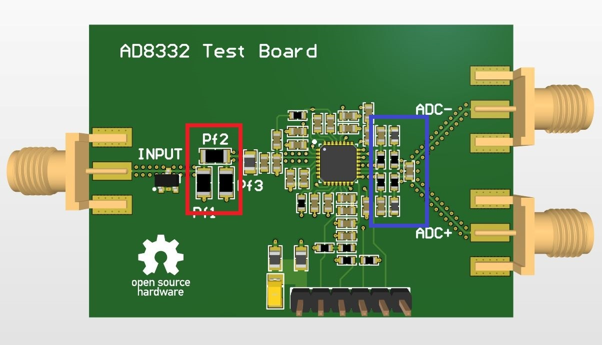
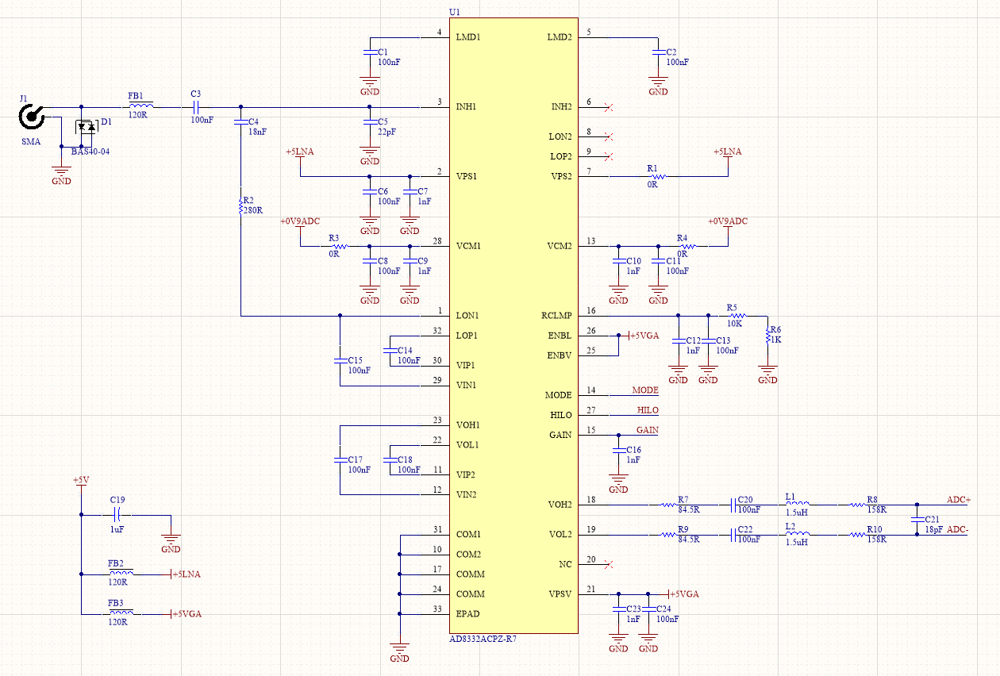
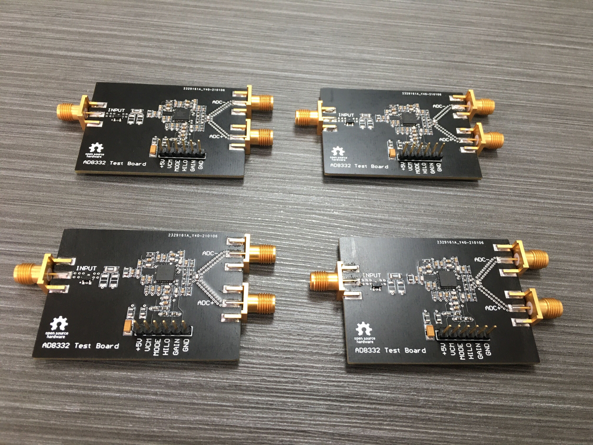
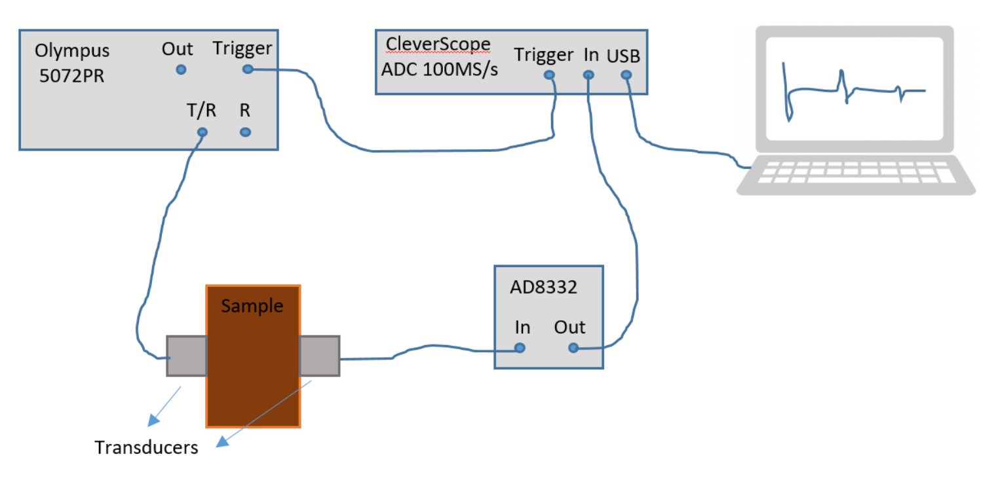
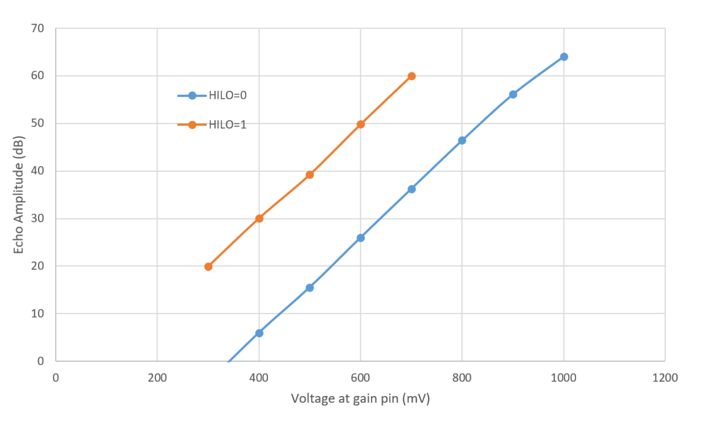

[](https://www.patreon.com/kelu124) 
[](https://ko-fi.com/G2G81MT0G)

[](https://join.slack.com/t/usdevkit/shared_invite/zt-2g501obl-z53YHyGOOMZjeCXuXzjZow)
[](http://commonmark.org)


# AD8332-devboard




Changing filter components is more or less "easy". Two places contain footprints for filters, one on the input and another on the output to the ADC.
* The input filter has three 1206 footprints (one in serial and two in parallel to input signal). 
* The output filter is a bit more complex (20MHz LPF) and composed out of 0603 SMD parts. Those are also easy to replace with an air solder station and tweezers.

More on the output filter [in here](datasheets/aa_filter_report.pdf).

# Overview



On this schematics, VOH/VOL1 and VIP2/VIN2 seem inverted, but the device appears to be working as well.

# Testing 



### Setup



### Results




# License

See [LICENSE.txt](LICENSE.txt)

```
 ------------------------------------------------------------------------------
| SPDX-FileCopyrightText: 2020 Jorge Arija, Luc Jonveaux                       |
| SPDX-License-Identifier: CERN-OHL-S-2.0                                      |
|                                                                              |
| This source describes Open Hardware and is licensed under the CERN-OHL-S v2. |
|                                                                              |
| You may redistribute and modify this source and make products using it under |
| the terms of the CERN-OHL-S v2 (https://ohwr.org/cern_ohl_s_v2.txt).         |
|                                                                              |
| This source is distributed WITHOUT ANY EXPRESS OR IMPLIED WARRANTY,          |
| INCLUDING OF MERCHANTABILITY, SATISFACTORY QUALITY AND FITNESS FOR A         |
| PARTICULAR PURPOSE. Please see the CERN-OHL-S v2 for applicable conditions.  |
|                                                                              |
| Source location: https://github.com/kelu124/ft600/                           |
|                                                                              |
| As per CERN-OHL-S v2 section 4, should You produce hardware based on this    |
| source, You must where practicable maintain the Source Location visible      |
| on the external case of the Gizmo or other products you make using this      |
| source.                                                                      |
 ------------------------------------------------------------------------------
```

[More details in cern_ohl_s_v2](https://ohwr.org/project/cernohl/wikis/Documents/CERN-OHL-version-2)


